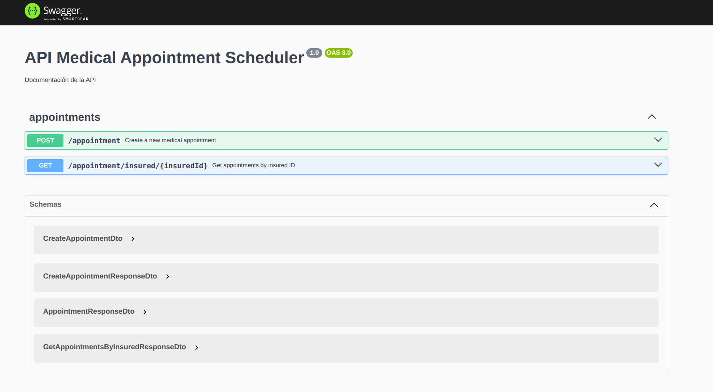

# Medical Appointment Scheduling Backend - Hexagonal Architecture
Una aplicación backend sin servidor para programar citas médicas para pacientes asegurados en Perú (PE) y Chile (CL), construida utilizando principios de Arquitectura Hexagonal.
## Architecture Overview

### AWS Services Flow
1. **API Gateway + Lambda**: Recibe solicitudes de citas
2. **DynamoDB**: Almacena los datos de las citas con seguimiento de estado
3. **SNS**: Enruta mensajes por país utilizando filtros de mensajes
4. **SQS**: Colas para procesamiento específico por país (PE/CL)
5. **EventBridge**: Maneja eventos de finalización de citas
6. **Lambda Functions**: Procesan citas por país y actualizan el estado

### Hexagonal Architecture Structure

```
src/modules/appointment/
├── domain/                          
│   ├── entities/
│   │   └── appointment.entity.ts    
│   ├── enums/
│   │   └── appointment-status.enum.ts
│   ├── repositories/
│   │   └── appointment.repository.interface.ts 
│   └── services/
│       └── notification.service.interface.ts
├── application/                      
│   ├── dto/
│   │   └── create-appointment.dto.ts
│   ├── ports/
│   │   ├── input/                  
│   │   │   ├── create-appointment.use-case.ts
│   │   │   └── get-appointments-by-insured.use-case.ts
│   │   └── output/                  
│   │       ├── appointment-repository.port.ts
│   │       └── notification-service.port.ts
│   └── use-cases/                    
│       ├── create-appointment.use-case.ts
│       └── get-appointments-by-insured.use-case.ts
├── infrastructure/                   
│   └── adapters/
│       ├── input/                   
│       │   └── web/
│       │       └── appointment.controller.ts
│       └── output/                  
│           ├── persistence/
│           │   ├── dynamodb-appointment.repository.ts 
│           │   └── schemas/
│           │       └── appointment.schema.ts
│           └── notification/
│               └── sns-notification.service.ts
```

## API Endpoints

### POST /appointment
Crear una nueva cita medica

```bash
https://infdf6ymzf.execute-api.us-east-1.amazonaws.com/dev/appointment
```
**Request Body:**
```json
{
  "insuredId": "00003",
  "scheduleId": 123,
  "countryISO": "PE"
}
```

**Response:**
```json
{
  "message": "El agendamiento está en proceso",
  "appointmentId": "da9301cd-2475-41c6-8287-13eee34a4aac",
  "status": "pending"
}
```

### GET /appointment/insured/{insuredId}
Recupera todas las citas para un paciente asegurado específico.

```bash
https://infdf6ymzf.execute-api.us-east-1.amazonaws.com/dev/appointment/insured/00003
```

**Response:**
```json
{
  "insuredId": "00003",
  "appointments": [
    {
      "id": "3aa4054f-f27d-409f-85eb-0478406aba4d",
      "insuredId": "00003",
      "scheduleId": 123,
      "countryISO": "PE",
      "status": "completed",
      "createdAt": "2025-06-21T07:41:08.613Z",
      "updatedAt": "2025-06-21T07:41:08.629Z"
    }
  ],
  "total": 2
}
```

## Setup and Installation

### Prerequisites
- Node.js 20.x
- AWS CLI configured
- Serverless Framework

### Agregar un env.ts para las credenciales de aws
```bash
#/src/infrastructure/config/env.ts
export const Env = {
  ACCOUNT_ID: '************',
};
```

## Development

### Local Development

```bash
# Or start with serverless offline
docker run -d -p 8000:8000 --name dynamodb-local amazon/dynamodb-local
npm run sls:offline
```

### Testing

```bash
# Run e2e tests
npm run test:e2e
```

## Deployment

```bash
# Deploy to AWS
npm run deploy
```

## API Documentation
- Local: http://localhost:3000/dev/api-docs
- Produccion: https://infdf6ymzf.execute-api.us-east-1.amazonaws.com/dev/api-docs
- 